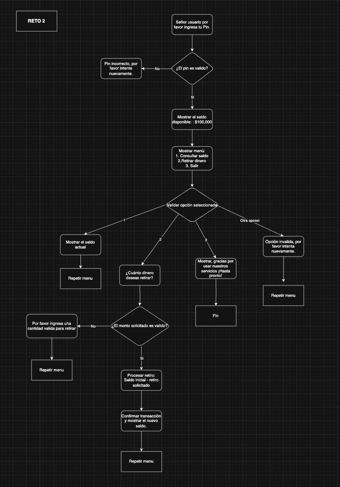

# Desafio 3 - Reto 2 

## 🧾 Descripción:

Se presenta la solucion al reto numero 2 del desafio tecnico de la semana 3.

## 🛠️ Tecnologías utilizadas:

- HTML5  
- JS
- Font Awesome 

## Pseudocódigo:

## 📌 Autor:

**Evelyn Becerra**  
[GitHub](https://github.com/evelin-bcr)